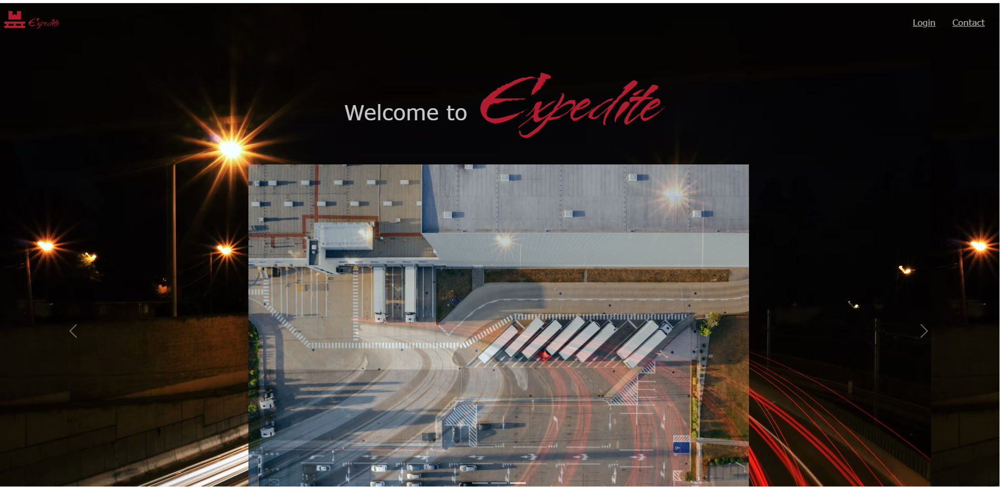
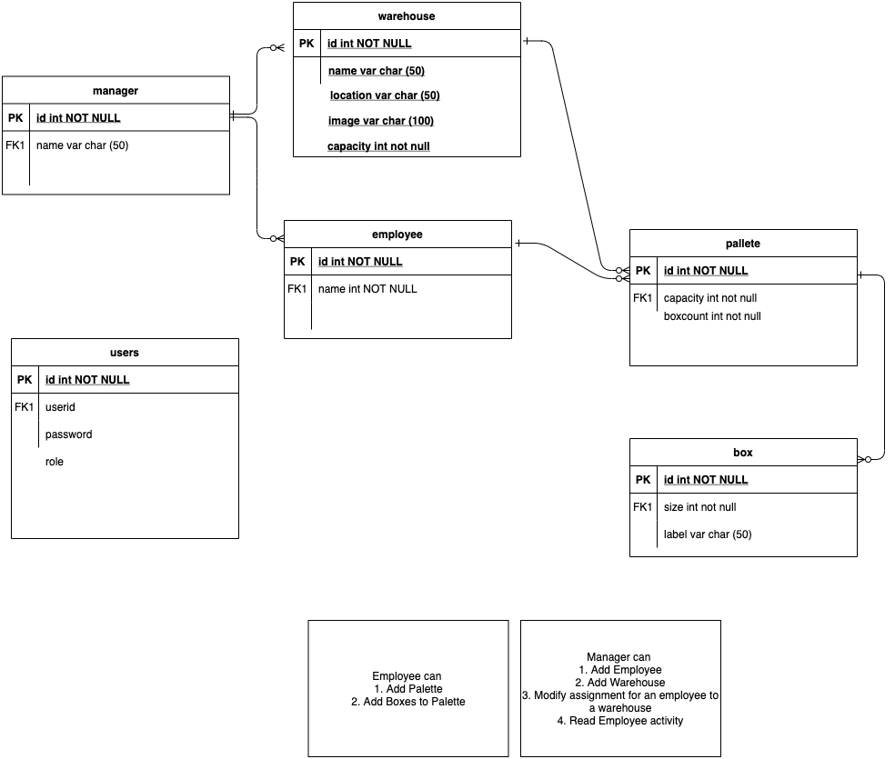
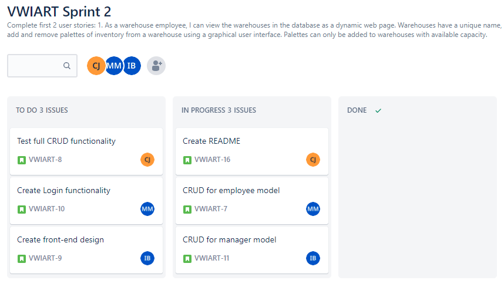

<h1 style="text-align:center;"> Expedite Warehouse and Inventory Management App </h1>

<h1 style="text-align:center;"> Project Description </h1> 

The goal of this project is to create an app that allows users to efficiently manage our warehouse database.  There are two user types for our app: managers and employees.

Managers are able to:
1. Log into a password protected manager view. 
2. Add and remove warehouses from the database. 
3. Add and remove warehouse employees from the database. 
4. Update the worksite of a given employee. 

Employees are able to:
1. Log into a password protected employee view. 
2. Add and remove palettes and boxes from the database. 

**NOTE: Employees are associated with a specific worksite and may only view, add or remove inventory from that site. 

<h1 style="text-align:center;"> Technologies Used: </h1>
<ul>
<li><a href="https://code.visualstudio.com/">Visual Studio Code</a></li>
<li><a href="https://nodejs.org/">Node.js</a></li>
<li><a href="https://sequelize.org/">Sequelize</a></li>
<li><a href="https://www.sqlite.org/">SQLite 3</a></li>
<li><a href="https://expressjs.com/">Express.js</a></li>
<li><a href="https://drawio-app.com//">Draw.io</a></li>
<li><a href="https://moqups.com/">Moqups</a></li>
<li><a href="https://www.atlassian.com/software/jira">Jira</a></li>
<li><a href="https://getbootstrap.com/">Bootstrap</a></li>
<li><a href="https://fontawesome.com/">Font Awesome and <a href="https://fonts.google.com/">Google Fonts</a></li>
<li><a href="https://unsplash.com/">Unsplash and <a href="https://giphy.com/">Giphy</a></li>
<li><a href="https://coolors.co/">Coolors </a></li>
</ul>

<h1 style="text-align:center;"> Project Planning </h1>

<h1 style="text-align:center;"> Authors and acknowledgments </h1>

<li>Iyanna Bell - Front End Lead</li>
<li>Muneer Malik - Backend Lead</li>
<li>Crystal Johnson - Scrum Master</li> 

 
Thank you to Micheal Dunn-O'Connor for all of his assistance!